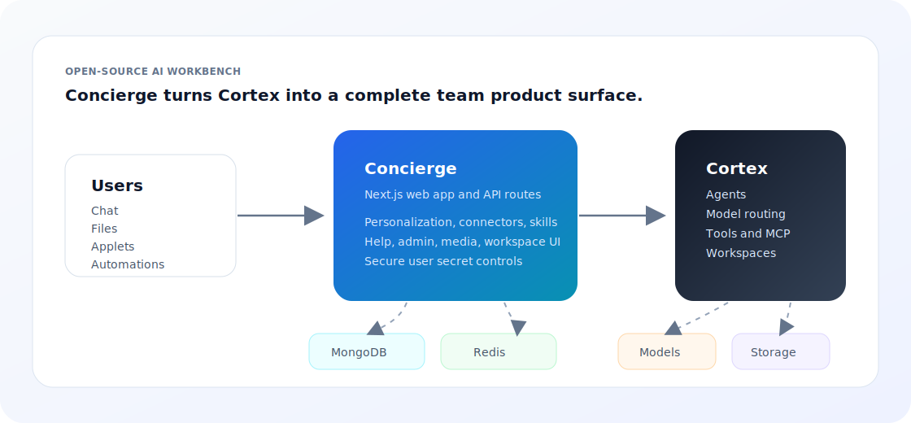

# Concierge

[](LICENSE)
[](https://github.com/aj-archipelago/cortex)
[](package.json)

Concierge is an open-source AI agent interaction portal: a direct interface to intelligent autonomous agents that can converse, use tools, generate media, run scheduled work, build interactive HTML, and host custom AI micro-applications.

It is the user-facing companion to [Cortex](https://github.com/aj-archipelago/cortex), the open-source AI backend that handles model routing, entity agents, tools, memory, media, and containerized workspaces. Concierge turns that runtime into a continuous product experience: chat when you need a conversation, applets when you need interactive software, automations when work should happen on a schedule, and built-in AI functions when a task deserves a dedicated interface.



## What You Get

- **A direct portal to autonomous agents.** Persistent chat, streaming tool progress, file attachments, model selection, reasoning controls, canvas previews, and workspace-aware execution give users one place to interact with capable AI agents.
- **Scheduling through automations.** Turn natural-language instructions into scheduled agent workflows with supporting files, run history, queue-backed execution, rendered HTML outputs, and pinned results.
- **Interactive HTML as a first-class medium.** Agents can create and update rich HTML outputs that users can preview, revise, publish, and keep working with instead of leaving results trapped in chat transcripts.
- **Custom AI micro-application development.** Generate, edit, version, publish, and debug applets with the injected `ConciergeSDK`, applet-scoped files, private data, shared data, locale helpers, service tokens, and model/agent calls.
- **A full-featured media generation studio.** Use Cortex-backed image, video, audio, transcription, translation, media-library sync, file proxying, preview, tagging, and storage workflows from a dedicated product surface.
- **Built-in AI functions for real workflows.** Video transcription, language translation, writing tools, style-guide checks, document-aware chat, media generation, and other focused features sit beside the open-ended agent interface.
- **Infinite expansion points.** Add connectors, MCP servers, skills, applets, automations, task handlers, API routes, media tools, admin screens, and product-specific workflows without changing the core architecture.
- **Operational controls.** Manage users, queues, feedback, usage reports, style guides, SDK examples, secure workspace secrets, and debug views from the built-in admin and personalization surfaces.

## Why Concierge Exists

Most AI applications start as a chat box. Real agent products quickly need more: scheduling, files, OAuth connectors, media generation, custom instructions, interactive outputs, app publishing, workspace secrets, admin views, and product-specific tools.

Concierge puts those pieces in one open Next.js application and keeps them connected. A chat can create a file. A file can become an applet. An applet can call the agent. An automation can produce an HTML report. A connector can give the agent permissioned external context. A secret can follow the user's entity into a private workspace. The result is not a pile of AI widgets; it is a portal for continuous interaction with intelligent agents.

The goal is not to hide the complexity. It is to make the seams explicit enough that a team can own them:

- The UI is regular React and Next.js.
- Agent execution lives in Cortex.
- User state, applets, automations, skills, and connector metadata live in MongoDB.
- Long-running work goes through Redis-backed BullMQ workers.
- Secure user secrets stay in Cortex entity configuration and are injected into workspaces by the backend.
- Product-specific surfaces can be removed, replaced, or white-labeled without rewriting the core app.

## Start Here

If you are new to Concierge, pick the lane closest to what you are trying to do:

| If you want to...           | Start with...                                         | Why                                                                         |
| --------------------------- | ----------------------------------------------------- | --------------------------------------------------------------------------- |
| Run the app locally         | [Local Development](#local-development)               | Starts the Next app and worker against local MongoDB, Redis, and Cortex.    |
| Connect Concierge to agents | [Cortex Backend](#cortex-backend)                     | Concierge delegates models, agents, tools, media, and workspaces to Cortex. |
| Build AI micro-applications | [Applets](#applets)                                   | Applets package interactive agent-powered tools inside Concierge.           |
| Add scheduled agent work    | [Automations](#automations)                           | Automations run saved agent instructions on a schedule through the queue.   |
| Add external tools          | [Connectors And MCP](#connectors-and-mcp)             | OAuth and MCP let the assistant use services outside Concierge.             |
| Operate a deployment        | [Configuration](#configuration) and [Docker](#docker) | These sections cover the important runtime settings and containers.         |

## Local Development

### Prerequisites

- Node.js and npm. The Docker images use Node.js 22.
- MongoDB.
- Redis.
- A running Cortex server, typically at `http://localhost:4000/graphql`.
- Optional: a Cortex media helper URL for media generation, transcription, and file-helper flows.

Install dependencies:

```sh
npm install
```

Create `.env.local`:

```sh
MONGO_URI=mongodb://127.0.0.1:27017/concierge
REDIS_CONNECTION_STRING=redis://127.0.0.1:6379
CORTEX_GRAPHQL_API_URL=http://127.0.0.1:4000/graphql
CORTEX_MEDIA_API_URL=http://127.0.0.1:5000
NEXT_PUBLIC_APP_URL=http://localhost:3000
```

Start the web app and worker together:

```sh
npm run dev
```

The Next.js app runs at `http://localhost:3000`. The worker process runs in the same terminal group and processes background jobs from Redis.

For narrower development:

```sh
npm run next:dev     # web app only
npm run worker:dev   # worker only
```

## Cortex Backend

Concierge is designed to run with Cortex. The important contract is:

- `CORTEX_GRAPHQL_API_URL` points at the Cortex GraphQL endpoint.
- `CORTEX_MEDIA_API_URL` points at the Cortex media helper endpoint when media/file-helper features are enabled.
- Each Concierge user gets a Cortex context id and can be provisioned a personal Cortex entity.
- The app sends chat, tool, model, workspace, media, and entity calls through Cortex GraphQL or media-helper routes.

For a minimal local Cortex run, see the Cortex README. A common local setup is:

```sh
cd ../cortex
npm install
npm start
```

Then run Concierge with:

```sh
CORTEX_GRAPHQL_API_URL=http://127.0.0.1:4000/graphql npm run dev
```

## Configuration

Concierge reads runtime configuration from environment variables and `config/default/config/index.js`.

### Core

| Variable                        | Required          | Purpose                                                                                                                   |
| ------------------------------- | ----------------- | ------------------------------------------------------------------------------------------------------------------------- |
| `MONGO_URI`                     | Yes               | MongoDB connection string for users, chats, workspaces, applets, automations, skills, connector metadata, and admin data. |
| `REDIS_CONNECTION_STRING`       | Yes for workers   | Redis connection string for BullMQ queues and background task processing. Defaults to local Redis in worker utilities.    |
| `CORTEX_GRAPHQL_API_URL`        | Yes               | Cortex GraphQL endpoint used by the app, worker, and server routes.                                                       |
| `CORTEX_MEDIA_API_URL`          | Feature-dependent | Cortex media helper URL for media generation, transcription, file-helper, and media proxy flows.                          |
| `NEXT_PUBLIC_APP_URL`           | Recommended       | Public app origin used to build OAuth redirect URIs and feedback links.                                                   |
| `NEXT_PUBLIC_BASE_PATH`         | Optional          | Base path when Concierge is hosted below a subpath.                                                                       |
| `NEXT_PUBLIC_AMPLITUDE_API_KEY` | Optional          | Enables browser analytics.                                                                                                |
| `MAX_FILE_SIZE`                 | Optional          | Upload validation limit in bytes.                                                                                         |

### Auth

Concierge supports Entra-backed production auth and a local development auth cookie.

| Variable                      | Required              | Purpose                                                                    |
| ----------------------------- | --------------------- | -------------------------------------------------------------------------- |
| `ENTRA_AUTHORIZED_TENANT_IDS` | Production with Entra | Comma-separated tenant ids allowed through middleware and user resolution. |

In development, local auth can create a test user without Entra headers. In production, missing or unauthorized Entra tenant information is rejected.

### Connectors

| Variable                                                 | Purpose                                                                                                                     |
| -------------------------------------------------------- | --------------------------------------------------------------------------------------------------------------------------- |
| `SLACK_CLIENT_ID` / `SLACK_CLIENT_SECRET`                | Slack OAuth connector.                                                                                                      |
| `SLACK_WEBHOOK_URL`                                      | Sends product feedback and queue alerts to Slack.                                                                           |
| `NEXT_PUBLIC_ATLASSIAN_CLIENT_ID` / `JIRA_CLIENT_SECRET` | Atlassian/Jira OAuth connector and applet service-token flows.                                                              |
| `GITHUB_CLIENT_ID` / `GITHUB_CLIENT_SECRET`              | GitHub OAuth/MCP connector.                                                                                                 |
| `MCP_ALLOW_PRIVATE_URLS`                                 | Allows private-network MCP server URLs outside production. Keep disabled in production unless you understand the SSRF risk. |

### Media And Transcription

| Variable                            | Purpose                                                                             |
| ----------------------------------- | ----------------------------------------------------------------------------------- |
| `ENABLE_XAI_TRANSCRIBE`             | Shows and accepts xAI transcription model options.                                  |
| `ENABLE_XAI_TRANSCRIBE_DEFAULT`     | Uses `xAI + Gemini` as the regular-media default when xAI transcription is enabled. |
| `TRANSCRIBE_DEFAULT_MODEL_OPTION`   | Overrides the default transcription model option.                                   |
| `TRANSCRIBE_ALTERNATE_MODEL_OPTION` | Overrides the alternate transcription model option.                                 |
| `ENABLE_NEURALSPACE`                | Enables NeuralSpace-related UI metadata.                                            |

### Secure Secrets And CSFLE

Concierge includes a generic secure secrets UI in the personalization portal. Users can store named secrets on their personal Cortex entity; Cortex can then inject those values into the user's agent workspace as environment variables. Existing secret values are not revealed back to the browser.

MongoDB client-side encryption support uses the Mongo crypt shared library when available:

| Variable          | Purpose                                                                                                |
| ----------------- | ------------------------------------------------------------------------------------------------------ |
| `MONGOCRYPT_PATH` | Path to `mongo_crypt_v1.so`; the Docker images install it at `/app/mongo_crypt_lib/mongo_crypt_v1.so`. |

## Docker

The repository includes app and worker images plus a development `docker-compose.yml`.

```sh
docker compose up --build
```

The compose file expects MongoDB, Redis, and Cortex to be reachable from the host machine through `host.docker.internal`:

- MongoDB: `mongodb://host.docker.internal:27017/concierge`
- Cortex: `http://host.docker.internal:4000/graphql`
- Redis: `redis://host.docker.internal:6379`

It also reads `.env.local` at runtime. The compose setup is useful when you want the Concierge processes in containers but still run infrastructure services on your host.

Production images:

- `Dockerfile` builds the Next.js standalone app image and runs `node server.js`.
- `Dockerfile.worker` builds the worker image and runs `npm run worker`.

Both images install the MongoDB crypt shared library used by encrypted MongoDB flows.

## Applets

Applets are custom AI micro-applications stored and hosted by Concierge. Users can ask an agent to build one, inspect and edit the source, save immutable versions, publish direct links, and keep the applet live in the canvas while the conversation continues.

Applet runtime capabilities include:

- Auto-injected `ConciergeSDK`.
- Agent calls through `ConciergeSDK.agent.chat`.
- Direct model calls through `ConciergeSDK.models.generate`.
- OAuth service tokens through `ConciergeSDK.services.getAccessToken`.
- Applet-scoped file upload/list/delete helpers.
- Per-user private applet data through `ConciergeSDK.data`.
- Shared applet state with revision protection through `ConciergeSDK.sharedData`.
- Locale and direction helpers for English/Arabic UI.
- Query-parameter helpers for published or embedded applets.

The admin SDK playground is available under `app/admin/sdk-playground`.

## Automations

Automations let autonomous agents keep working after the chat window closes. A user describes recurring work in natural language, Concierge turns it into saved instructions and schedule metadata, and the worker queue runs it on time.

Each automation has:

- `AUTOMATION.md` instructions.
- Optional supporting files.
- A schedule preset or custom schedule.
- Output type, including rendered HTML output.
- Run history and pinned outputs.

The main worker entry point is `jobs/worker.js`. Automation execution lives in `jobs/tasks/automation-run.mjs`, and scheduler logic lives in `jobs/automation-scheduler.js`.

Useful routes and surfaces:

- `/automations`
- `/automations/[id]`
- `app/api/automations`
- `app/api/automations/[id]/run`
- `app/api/automations/[id]/runs`
- `src/components/automations`

## Connectors And MCP

Concierge can connect the assistant and applets to external systems.

Built-in connector surfaces include:

- Slack OAuth and bot-message sending.
- Atlassian/Jira OAuth, issue/project APIs, and applet service-token access.
- GitHub OAuth/MCP initialization.
- Custom MCP servers with bearer-token or OAuth connection flows.

The MCP configuration dialog lets users add custom servers. Server-side validation blocks unsafe MCP URLs by default, especially in production.

## Skills

Skills are reusable instructions and supporting files that the assistant can load when they match a request. Concierge includes built-in applet/article skills and lets users create custom skills from the personalization portal.

Skill APIs live under:

- `app/api/skills`
- `app/api/skills/[name]`
- `app/api/skills/[name]/files`

Client-side skill definitions and built-in instruction text live in `src/utils/skills.js`.

## Files, Media, And Workspaces

Concierge treats files and media as part of the agent interaction loop, not as side attachments. A generated image can stay in the media studio, become chat context, move into a workspace, or be referenced by an applet. HTML outputs can be previewed, published, edited, and reused.

Related surfaces include:

- Chat attachments and generated files.
- Workspace files and published workspaces.
- Applet files and published applet assets.
- Media library items, tags, preview URLs, and storage sync.
- Text, image, and media proxy routes.

Important directories:

- `src/components/common/UnifiedFileManager`
- `src/components/images`
- `app/api/files`
- `app/api/media-items`
- `app/api/workspaces`
- `app/workspaces`
- `jobs/tasks/media-generation.mjs`

## Help And Release Notes

The in-app help system is built from Markdown content:

- `src/content/help-guides/*.md`
- `src/content/help-guides/*.ar.md`
- `src/content/help-guides.js`
- `src/components/help`
- `app/help`

The release-notes UI is present and ready for project-specific entries. Open-source Concierge does not ship the downstream product's private release history. Add public release notes under `src/content/release-notes/` and register them in `src/content/release-notes/index.js`.

## Admin

The admin area includes:

- User management.
- Queue monitoring.
- Feedback review.
- Usage reporting and API-key mappings.
- Style-guide management.
- SDK playground.
- Debug pages.

Admin APIs should always call `getCurrentUser()` and enforce `role === "admin"` before returning sensitive data or allowing mutation.

## Project Map

| Path              | Purpose                                                                         |
| ----------------- | ------------------------------------------------------------------------------- |
| `app/`            | Next.js App Router pages, layouts, and API routes.                              |
| `src/components/` | React component library used by pages and client surfaces.                      |
| `src/content/`    | Help guides, release-note loader, SDK docs, and Markdown content.               |
| `src/utils/`      | Client utilities, tool definitions, skill text, theme helpers, storage helpers. |
| `src/graphql.js`  | Cortex GraphQL queries and mutations used by the client and server.             |
| `app/api/utils/`  | Server utility layer for auth, queues, MCP, media, files, and validation.       |
| `jobs/`           | Worker process, scheduler, queue jobs, and long-running task handlers.          |
| `config/default/` | Product configuration, locale files, taxonomy data, and global content.         |
| `playwright/`     | End-to-end test fixtures and flows.                                             |
| `docs/`           | Contributor-facing operational docs.                                            |

## Scripts

| Command                  | Purpose                                                                     |
| ------------------------ | --------------------------------------------------------------------------- |
| `npm run dev`            | Runs Next.js and the worker together.                                       |
| `npm run next:dev`       | Runs only the Next.js development server.                                   |
| `npm run worker:dev`     | Runs only the worker with nodemon.                                          |
| `npm run build`          | Builds the Next.js app.                                                     |
| `npm start`              | Starts the built Next.js app with `next start`.                             |
| `npm run worker`         | Starts the production worker process.                                       |
| `npm test`               | Runs Jest tests.                                                            |
| `npm run test:e2e`       | Runs Playwright tests.                                                      |
| `npm run lint`           | Runs Next lint and Prettier checks.                                         |
| `npm run format`         | Formats the repo with Prettier.                                             |
| `npm run precommit`      | Runs lint, format, and Jest tests.                                          |
| `npm run upstream:audit` | Runs the downstream/upstream audit helper used for open-source parity work. |

## Testing

Focused unit tests:

```sh
npm test -- --runInBand path/to/test.js
```

Full Jest suite:

```sh
npm test -- --runInBand
```

Build:

```sh
npm run build
```

Playwright:

```sh
npm run test:e2e
```

Set `PLAYWRIGHT_BASE_URL` or `BASE_URL` when running Playwright against an already-running deployment.

## What Concierge Is Not

Concierge is not a hosted SaaS by itself, a model provider, or a replacement for Cortex. It is the open product layer you put in front of Cortex when you want a fully-functioned AI agent interaction portal instead of a single chat route.

You should expect to configure your own:

- Cortex deployment and model credentials.
- MongoDB and Redis.
- Auth boundary.
- OAuth apps for connectors.
- Storage/media-helper deployment.
- Branding, help content, and release notes.

## License

Concierge is released under the [MIT License](LICENSE).
